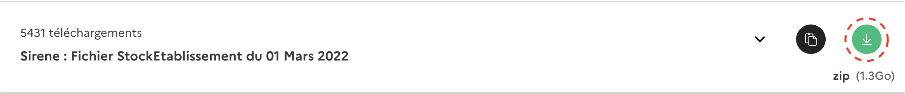

<h1 align="center">Distributed Architecture Project</h1>

> **LE ROY-NIVOT** Mathis, **VERA** Samy, **RIGAUDEAU** Léo

 

- **[📄 FR Documentation](https://gem-zoo-d8b.notion.site/Architecture-distribu-e-Projet-Fil-Rouge-ed4ea0889c494f29a3d2e2e2d9905940)**

# Installation 🔧

First, download the following **[file](https://www.data.gouv.fr/fr/datasets/base-sirene-des-entreprises-et-de-leurs-etablissements-siren-siret/)** (named *Sirene : Fichier StockEtablissement du 01 Mars 2022*)

