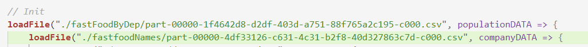

<h1 align="center">Distributed Architecture Project</h1>

> **LE ROY-NIVOT** Mathis, **VERA** Samy, **RIGAUDEAU** Léo

<div align="center">

[](https://shields.io/) [](https://github.com/MathisLeRoyNivot/big-data-final-project/main/LICENSE)

[](https://forthebadge.com)

</div>

<hr />

- **[📄 Report [🇫🇷 FR Version]](https://gem-zoo-d8b.notion.site/Architecture-distribu-e-Projet-Fil-Rouge-ed4ea0889c494f29a3d2e2e2d9905940)**
- **[📄 Report [🇬🇧 EN Version]](https://gem-zoo-d8b.notion.site/Distributed-Architecture-Major-Project-2444f67ae49d43c8baa30daf56a07aa6)**

<hr />

# Table of content

- [Installation](#installation)
- [Run project](#scala-execution)
- [Contributors](#contributors)

<div id="installation">

# Installation 🔧

First, download the following **[file](https://www.data.gouv.fr/fr/datasets/base-sirene-des-entreprises-et-de-leurs-etablissements-siren-siret/)** (named *Sirene : Fichier StockEtablissement du 01 Mars 2022*)

<div align="center">

<a href="https://www.data.gouv.fr/fr/datasets/base-sirene-des-entreprises-et-de-leurs-etablissements-siren-siret/">


</a>

</div>

Once you downloaded the file, place it at the root of the repository.

</div>
If you don't want to download the document, we have given you access to a "SHORT" version which has only the first 1000 lines of the dataset. To use it please change the path in public/file.scala & public/transData.scala


> StockEtablissement_utf8.csv --> SHORT_StockEtablissement_utf8.csv

<div id="scala-execution">

# Run project :arrow_forward:
## Default
In this project, you can have direct access to a default visualization. 

You have to execute the following commands in a command prompt positioned in our project: 

```bash
npm install
npm start
```

Open a browser and go to the following url 
>http://localhost:8888/

Then a map representing the number of fastfoods per 100 000 inhabitants opens.   
You can click on the different regions to see the Fast Food located here.

## Spécial
The POC also allows to filter on another NAF code. For that, you just have to launch our scala file.

- Start by dropping the document you just downloaded. Make sure that the document is in public/ in the project and that it has the name StockEtablissement_utf8.csv. 
- You can execute the Scala file with the following command in a command prompt positioned in our project: ( be careful you have to execute them in two steps! )

You can modify the codenaf to work on another body, here is the list: https://blog.easyfichiers.com/wp-content/uploads/2014/08/Liste-code-naf-ape.pdf ! Be careful the following link does not put any point of their NAF code but they are present in our dataset! Think to add them.


```bash
    spark-shell -i public/file.scala --conf spark.driver.codenaf="56.10C"
    spark-shell -i public/transData.scala --conf spark.driver.codenaf="56.10C"
```


When finished, the project has generated a floor file! To connect the documents you just generated with the graphical part you will have to change the paths in the file 

> public/client/js/main.js lines[61-62]



you will just have to refresh the page already launched with the default values! 


</div>

<div id="contributors">

## Contributors :computer:

- [Mathis LE ROY-NIVOT](https://github.com/MathisLeRoyNivot "Go to @MathisLeRoyNivot's Github")
- [Léo RIGAUDEAU](https://github.com/leorigaudeau "Go to @leorigaudeau's Github")
- [Samy VERA](https://github.com/samyvera "Go to @samyvera's Github")


</div>
